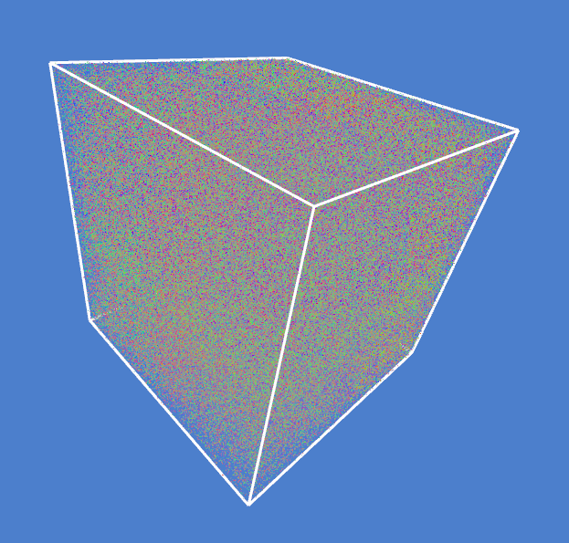

# Bounded Compute Particles
A minimal-ish project that sets up particles that are tweaked in a compute shader. See [my blog post on this project](https://emblaflatlandsmo.com/2022/01/25/simple-bounded-particles-using-compute-shaders-in-opengl/).

Some of the code is lifted from https://github.com/bartvbl/TDT4230-Assignment-1
 

## Project structure

`main.cpp` initializes the window, `program.cpp` is where everything is initialized and updated/rendered. Finally, the particle system is implemented in `particles/particleSystem.cpp`. It goes a bit deep but I just wanted to see if I could get my particle code to work with the initial code.
## Building:
1. `git clone --recursive https://github.com/Embla-Flatlandsmo/OpenGL-minimal-compute-particles.git`
2. `cd openGL-minimal-compute-particles`
3. `cmake .`
4. `cmake --build .`
5. The executable should be in `./Debug`

Alternatively using VS Code:
1. `git clone --recursive https://github.com/Embla-Flatlandsmo/OpenGL-minimal-compute-particles.git`
2. `cd openGL-minimal-compute-particles`
3. `code .`
4. Using the CMake extension, let cmake do its thing
5. Use `Ctrl+Shift+P` then type `CMake: Build`
The executable should be found in `/build/bin`

Note that because I'm using `file(COPY res DESTINATION ${CMAKE_RUNTIME_OUTPUT_DIRECTORY})` in the root `CMakeLists.txt`, the stuff in the res folder might not update inbetween builds. Haven't found a fix for that yet.
